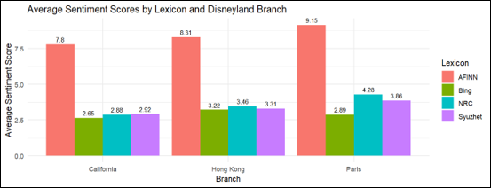
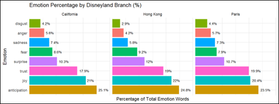
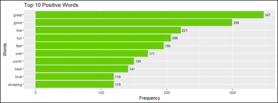
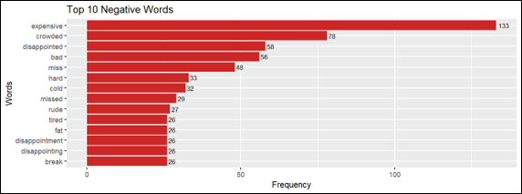
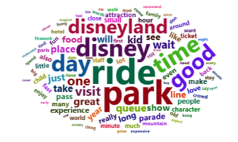

# 🎢💭 Sentiment Analysis of Disneyland Reviews

<p align="center">
  <strong>Exploring visitor experiences, emotions, and opinions through Natural Language Processing in R.</strong>
</p>

<p align="center">
  
  
  
  
</p>

---

## 🧭 Navigation

- [📌 Overview](#-overview)
- [🎯 Objectives](#-objectives)
- [📊 Dataset](#-dataset)
- [🗂️ Dataset Structure](#️-dataset-structure)
- [🛠️ Tools & Libraries](#️-tools--libraries)
- [🔬 Methodology](#-methodology)
- [💭 Sentiment Analysis](#-sentiment-analysis)
- [😊 Emotion Classification](#-emotion-classification)
- [👍 Positive & Negative Words](#-positive--negative-words)
- [☁️ Additional Word Analysis](#️-additional-word-analysis)
- [📈 Key Results](#-key-results)
- [💡 Key Findings](#-key-findings)
- [📝 Discussion](#-discussion)
- [🏁 Conclusion](#-conclusion)
- [📁 Project Files](#-project-files)
- [📚 References](#-references)

---

## 📌 Overview

This project performs **sentiment analysis and emotion classification** on online Disneyland visitor reviews.

The analysis focuses on reviews from three Disneyland branches:

🎡 **Disneyland California**
🎠 **Disneyland Paris**
🏰 **Disneyland Hong Kong**

Natural Language Processing (NLP) techniques are used to investigate whether visitors generally expressed positive or negative opinions, which emotions were most frequently associated with the reviews, and which words were commonly used to describe their experiences.

The analysis was conducted using **R** and several sentiment lexicons, including:

- 🔵 AFINN
- 🟢 Bing
- 🟦 NRC
- 🟣 Syuzhet

In addition, NRC emotion classification and positive/negative word frequency analysis were performed.

---

## 🎯 Objectives

The main objectives of this analysis are to:

1. Analyse the sentiment of Disneyland visitor reviews.
2. Compare sentiment scores between different Disneyland branches.
3. Compare sentiment scores obtained from different sentiment lexicons.
4. Identify the dominant emotions expressed in the reviews.
5. Determine the most frequently occurring positive and negative words.
6. Perform additional text analysis using word frequency and word clouds.
7. Interpret the overall visitor experience based on the textual data.

---

## 📊 Dataset

The dataset used in this project is the **Disneyland Reviews Dataset** obtained from Kaggle.

🔗 **Dataset Source:**
https://www.kaggle.com/datasets/arushchillar/disneyland-reviews

The dataset contains visitor reviews of Disneyland locations and includes information such as:

- Review text
- Disneyland branch
- Rating
- Reviewer information

For this analysis, the **review text** and **branch** information were primarily used.

### 🌍 Selected Disneyland Branches

| Branch | Location |
|---|---|
| 🇺🇸 Disneyland California | California, USA |
| 🇫🇷 Disneyland Paris | Paris, France |
| 🇭🇰 Disneyland Hong Kong | Hong Kong |

To ensure a fair comparison, an equal number of reviews were randomly sampled from each branch.

**300 reviews were selected from each branch**, resulting in:

> **900 reviews in total**

---

## 🗂️ Dataset Structure

The main variables relevant to this analysis are:

| Variable | Description |
|---|---|
| `Review_Text` | Textual review written by the visitor |
| `Branch` | Disneyland branch associated with the review |
| `Rating` | Visitor rating |

The `Review_Text` variable was used for sentiment and text analysis, while `Branch` was used to compare visitor experiences between Disneyland locations.

---

## 🛠️ Tools & Libraries

The analysis was conducted in **R** using the following packages:

| Package | Purpose |
|---|---|
| `readr` | Importing the dataset |
| `dplyr` | Data manipulation and sampling |
| `ggplot2` | Data visualization |
| `syuzhet` | Sentiment and emotion analysis |
| `tidytext` | Text tokenization and sentiment lexicons |
| `tm` | Text mining and preprocessing |
| `wordcloud` | Word cloud generation |
| `wordcloud2` | Interactive word cloud |
| `RColorBrewer` | Word cloud colour palettes |
| `textstem` | Lemmatization |
| `tidyr` | Reshaping sentiment results |

---

# 🔬 Methodology

The analysis was performed through several stages.

```text
Raw Disneyland Reviews
          │
          ▼
   Select 3 Branches
          │
          ▼
  Balanced Sampling
  300 Reviews / Branch
          │
          ▼
 ┌─────────────────────┐
 │  Sentiment Analysis  │
 │ AFINN / Bing / NRC   │
 │      / Syuzhet       │
 └─────────────────────┘
          │
          ▼
  Compare Sentiment
      by Branch
          │
          ▼
 ┌───────────────────────┐
 │ Emotion Classification │
 │       using NRC        │
 └───────────────────────┘
          │
          ▼
 Positive / Negative
   Word Analysis
          │
          ▼
 Additional Text Analysis
  Word Frequency & Cloud
```

## 1️⃣ Balanced Sampling

Because the number of available reviews differs between branches, random sampling was performed separately for each branch.

```r
set.seed(123)

california <- data %>%
  filter(Branch == "Disneyland_California") %>%
  sample_n(300)

paris <- data %>%
  filter(Branch == "Disneyland_Paris") %>%
  sample_n(300)

hongkong <- data %>%
  filter(Branch == "Disneyland_HongKong") %>%
  sample_n(300)
```

This resulted in an equal number of reviews from each branch, allowing a more balanced comparison.

---

# 💭 Sentiment Analysis

Four different sentiment lexicons were used:

### 🔵 AFINN

AFINN assigns numerical sentiment scores to words, where positive words receive positive values and negative words receive negative values.

### 🟢 Bing

The Bing lexicon classifies words into two categories:

- Positive
- Negative

### 🟦 NRC

The NRC lexicon associates words with positive and negative sentiment as well as different emotional categories.

### 🟣 Syuzhet

The Syuzhet lexicon assigns sentiment scores to text based on its sentiment dictionary.

---

## 📊 Sentiment Score Comparison

The average sentiment score for each branch was calculated using all four lexicons.

| Branch | AFINN | Bing | NRC | Syuzhet |
|---|---|---|---|---|
| California | 7.80 | 2.65 | 2.88 | 2.92 |
| Hong Kong | 8.31 | 3.22 | 3.46 | 3.31 |
| Paris | 9.15 | 2.89 | 4.28 | 3.86 |

### 📌 Interpretation

All four lexicons produced **positive average sentiment scores across all three Disneyland branches**, indicating that visitors generally expressed favourable experiences.

Disneyland Paris recorded the highest AFINN mean score of **9.15**, followed by Hong Kong (**8.31**) and California (**7.80**). The magnitude of the scores differs between lexicons because each lexicon uses a different sentiment scoring method.

AFINN generally produced the largest numerical values because it assigns weighted scores to individual sentiment-bearing words.

---

## 📈 Sentiment Visualization

The sentiment scores were visualized to compare the four lexicons across the three Disneyland branches.



### 🔎 Main Observation

Although the numerical values vary between lexicons, the overall sentiment remains positive across all three branches.

This consistency strengthens the conclusion that Disneyland reviews were generally favourable.

---

# 😊 Emotion Classification

The **NRC lexicon** was also used to identify eight major emotions:

- 😡 Anger
- 🔮 Anticipation
- 🤢 Disgust
- 😨 Fear
- 😢 Sadness
- 😲 Surprise
- 🤝 Trust
- 😄 Joy

Emotion classification was performed separately for California, Hong Kong, and Paris.

---

## 📊 Emotion Percentage Comparison 



The percentage analysis provides a clearer comparison because the total number of emotion-related words may differ between branches.

The results indicate that **anticipation, joy, and trust** were the dominant emotions across the Disneyland branches.

Anticipation was particularly prominent, which is reasonable because visitors often describe their excitement before and during their Disneyland experience.

Joy was also one of the strongest emotions, reflecting enjoyment of rides, attractions, entertainment, and the overall Disneyland atmosphere.

Negative emotions such as anger, disgust, sadness, and fear appeared considerably less frequently.

Across the three branches:

- **Anticipation** was approximately 23–25%.
- **Joy** was approximately 20–22%.
- **Trust** was approximately 18–20%.
- **Surprise** contributed around 10–12%.
- Negative emotions generally represented smaller proportions.

These results further support the positive sentiment findings.

---

# 👍 Positive & Negative Words

The Bing sentiment lexicon was used to identify commonly occurring positive and negative words.

---

## 💚 Top Positive Words

The most frequent positive words included:

- `great`
- `good`
- `like`
- `fun`
- `fast`
- `well`
- `worth`
- `best`
- `love`
- `amazing`



The high frequency of words such as **"great", "good", "fun", "love", and "amazing"** indicates that visitors frequently described their Disneyland experiences in favourable terms.

The word **"fun"** is particularly relevant because Disneyland is primarily an entertainment destination, while words such as **"love"** and **"amazing"** suggest strong positive emotional reactions.

---

## ❤️‍🩹 Top Negative Words

The most frequent negative words included:

- `expensive`
- `crowded`
- `disappointed`
- `bad`
- `miss`
- `hard`
- `cold`
- `missed`
- `rude`
- `tired`



The most frequently occurring negative word was **"expensive"**, suggesting that cost was an important concern among some visitors.

The word **"crowded"** was also prominent, indicating that large crowds and potentially long queues were common sources of dissatisfaction.

Despite these negative aspects, the overall sentiment analysis remained positive.

---

# ☁️ Additional Word Analysis

Text preprocessing was conducted as an **additional analysis** to investigate the most frequently occurring words in the reviews.

The preprocessing steps included:

1. Converting text to lowercase
2. Removing numbers
3. Removing punctuation
4. Removing English stopwords
5. Removing selected irrelevant words
6. Removing unnecessary whitespace
7. Lemmatization

A Term-Document Matrix was then constructed to calculate word frequencies.

---

## ☁️ Word Cloud



The word cloud provides a visual representation of frequently occurring words.

Words such as:

> **disney, disneyland, ride, park, time, day, good, visit, people, queue**

were frequently mentioned in the reviews.

These words indicate that visitors commonly discussed their rides, time spent at the park, attractions, queues, and overall experiences.

The word cloud is treated as a supplementary analysis because frequency alone does not indicate whether a word is positive or negative.

---

# 📈 Key Results

The major findings from the analysis are summarized below:

| Analysis | Main Finding |
|---|---|
| Sentiment | All branches showed positive average sentiment |
| AFINN | Produced the highest numerical sentiment values |
| Best AFINN score | Disneyland Paris (9.15) |
| Emotion | Anticipation, joy, and trust were dominant |
| Positive words | Great, good, fun, love, amazing |
| Negative words | Expensive, crowded, disappointed, bad |
| Main concern | Cost and crowding |
| Overall experience | Generally positive |

---

# 💡 Key Findings

### 1. 🎢 Visitors were generally satisfied

All four sentiment lexicons produced positive average scores for all three Disneyland branches.

This suggests that positive experiences were more prominent than negative experiences.

---

### 2. 🇫🇷 Disneyland Paris showed the highest AFINN sentiment

Disneyland Paris obtained the highest average AFINN score:

> **9.15**

This was followed by:

> Hong Kong — **8.31**
> California — **7.80**

However, differences between branches should be interpreted together with the characteristics and scoring mechanisms of each lexicon.

---

### 3. 😄 Positive emotions dominated

The NRC emotion analysis showed that **anticipation, joy, and trust** were the most prominent emotions.

This reflects the excitement and enjoyment associated with Disneyland visits.

---

### 4. 💰 Cost was an important negative issue

The word **"expensive"** was the most frequently occurring negative word.

This suggests that visitors' dissatisfaction was not necessarily related to the attractions themselves but could also involve the cost of visiting Disneyland.

---

### 5. 👥 Crowding was another common complaint

The high frequency of **"crowded"** indicates that crowd levels and potentially long queues were common concerns.

This provides a useful managerial insight because visitor satisfaction may potentially be improved through better crowd and queue management.

---

# 📝 Discussion

The sentiment analysis demonstrates that the overall visitor experience across Disneyland California, Disneyland Hong Kong, and Disneyland Paris was predominantly positive.

The consistency across four sentiment lexicons is particularly important. Although the numerical scores differed due to the different scoring mechanisms used by AFINN, Bing, NRC, and Syuzhet, all methods produced positive average values. This suggests that the conclusion is not dependent on a single sentiment lexicon.

The emotion analysis further strengthens this finding. Anticipation, joy, and trust were consistently among the most prominent emotions. These emotions are closely related to the nature of Disneyland as an entertainment and family-oriented destination. Visitors commonly experience excitement when anticipating attractions and entertainment, while joy and trust can reflect satisfaction with the overall experience.

The word-frequency analysis also provided more specific information about what visitors liked and disliked. Positive terms such as "great", "good", "fun", "love", and "amazing" indicate that visitors frequently described Disneyland positively. In contrast, words such as "expensive", "crowded", "disappointed", and "bad" reveal areas of dissatisfaction.

Therefore, sentiment analysis does more than simply classify reviews as positive or negative. It can also identify specific aspects of the visitor experience that contribute to satisfaction or dissatisfaction.

---

# 🏁 Conclusion

Overall, the analysis shows that Disneyland visitors generally expressed positive experiences across California, Hong Kong, and Paris.

The four sentiment lexicons consistently produced positive scores, while NRC emotion classification showed that anticipation, joy, and trust were the dominant emotions.

The positive word analysis revealed frequent use of words such as "great", "good", "fun", "love", and "amazing". Meanwhile, "expensive" and "crowded" were among the most prominent negative terms, highlighting cost and crowding as potential areas of concern.

Therefore, the analysis demonstrates how sentiment analysis and text mining can transform large collections of customer reviews into meaningful insights about visitor satisfaction and areas that may require improvement.

---

# 📁 Project Files

```
📦 Sentiment_Analysis_of_Disneyland_Reviews
│
├── 📄 README.md
│
└── 📁 images
    ├── sentiment_scores.png
    ├── emotion_comparison.png
    ├── top_positive_words.png
    ├── top_negative_words.png
    └── wordcloud.png
```

---

# 📚 References

### Dataset

Arush Chillar. **Disneyland Reviews Dataset.**

Kaggle: https://www.kaggle.com/datasets/arushchillar/disneyland-reviews

### Sentiment Analysis

The analysis uses sentiment lexicons provided through the `syuzhet` and `tidytext` R packages, including AFINN, Bing, NRC, and Syuzhet.

---

<p align="center">

### 🎢 From Reviews → Sentiments → Emotions → Insights

<strong>Turning visitor opinions into meaningful data-driven findings.</strong>

</p>

<p align="center">
  ⭐ If you find this project useful, consider giving the repository a star!
</p>
